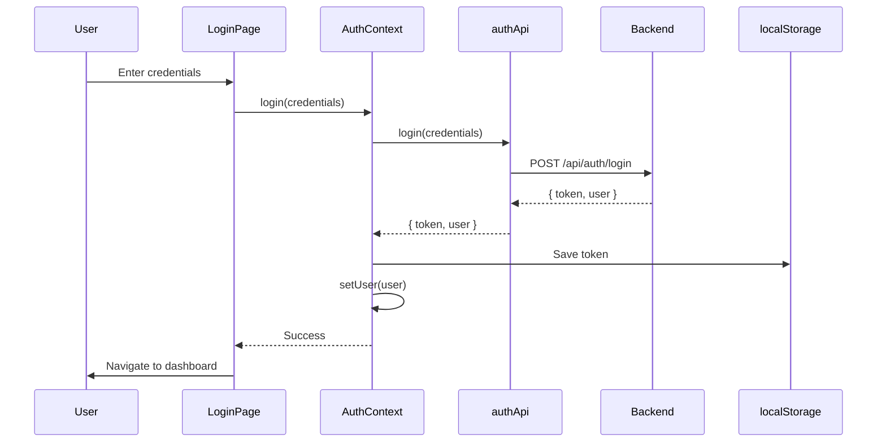
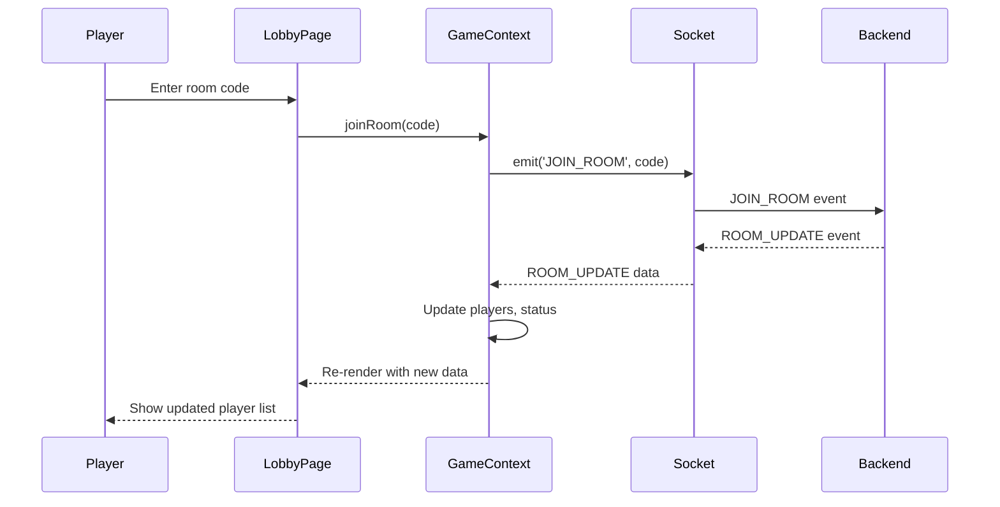
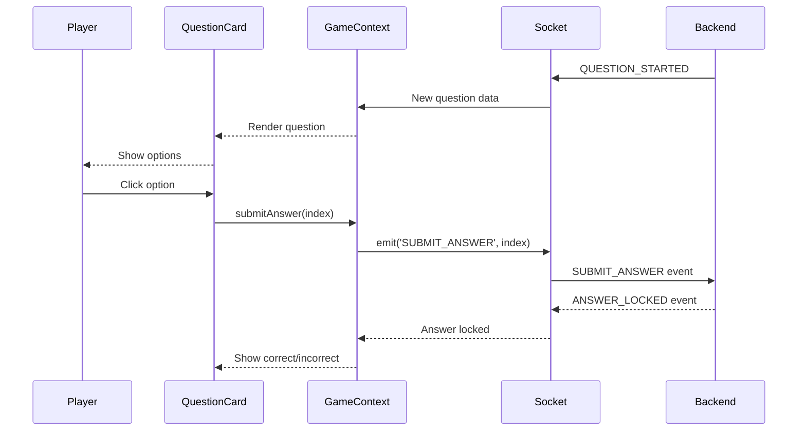

# QuizStorm Frontend Structure Guide

## Overview

The QuizStorm frontend is a **React 19** single-page application built with **Vite** as the build tool. It uses **TailwindCSS v4** for styling with a custom "Doodle Pop" theme, **Socket.IO** for real-time game communication, and **React Router v7** for navigation.

---

## Technology Stack

### Build Tool & Framework
- **Vite 7.2.4** - Ultra-fast build tool and dev server
- **React 19.2.0** - UI library with latest concurrent features
- **React DOM 19.2.0** - React renderer for web

### Routing
- **React Router DOM 7.10.1** - Client-side routing

### HTTP & Real-time Communication
- **Axios 1.13.2** - HTTP client for REST API calls
- **Socket.IO Client 4.8.1** - WebSocket connection for real-time game events

### Styling
- **TailwindCSS 4.1.18** - Utility-first CSS framework
- **@tailwindcss/vite 4.1.18** - Vite integration for Tailwind

### UI Enhancements
- **React Confetti 6.4.0** - Celebration animations for game results

### Development Tools
- **ESLint 9.39.1** - Code linting
- **eslint-plugin-react-hooks 7.0.1** - React Hooks linting rules
- **eslint-plugin-react-refresh 0.4.24** - Fast refresh linting
- **@vitejs/plugin-react 5.1.1** - Vite plugin for React Fast Refresh

---

## Project Structure

```
frontend/
├── index.html              # HTML entry point
├── vite.config.js         # Vite configuration
├── package.json           # Dependencies
├── .env                   # Environment variables
├── public/                # Static assets
└── src/
    ├── main.jsx          # Application entry point
    ├── App.jsx           # Root component
    ├── index.css         # Global styles + TailwindCSS theme
    ├── api/              # API client modules (7 files)
    ├── components/       # Reusable React components
    │   ├── game/        # Game-specific components (9 files)
    │   └── lobby/       # Lobby components (2 files)
    ├── context/          # React Context providers (2 files)
    ├── pages/            # Page-level components (12 files)
    ├── routes/           # Routing configuration (2 files)
    ├── socket/           # Socket.IO client setup (2 files)
    └── utils/            # Helper functions (2 files)
```

---

## Detailed Library Usage

### 1. React & React DOM (v19.2.0)

**Purpose**: Core UI library  
**Where Used**: Throughout entire application

**Key Files:**
- [`src/main.jsx`](file:///Users/sohamkarandikar/Documents/QuizStorm/frontend/src/main.jsx) - ReactDOM.createRoot initialization
- All component files (`.jsx` extension)

**Modern React 19 Features Used:**
- Concurrent rendering
- Automatic batching
- Server components support (not actively used)
- Improved Suspense behavior

**Example Usage** ([`src/main.jsx`](file:///Users/sohamkarandikar/Documents/QuizStorm/frontend/src/main.jsx)):
```jsx
import { StrictMode } from 'react'
import { createRoot } from 'react-dom/client'
import App from './App.jsx'

createRoot(document.getElementById('root')).render(
  <StrictMode>
    <App />
  </StrictMode>,
)
```

---

### 2. Vite (v7.2.4)

**Purpose**: Build tool, dev server, and hot module replacement (HMR)  
**Configuration**: [`vite.config.js`](file:///Users/sohamkarandikar/Documents/QuizStorm/frontend/vite.config.js)

**Plugins Used:**
1. `@vitejs/plugin-react` - Enables React Fast Refresh
2. `@tailwindcss/vite` - TailwindCSS v4 integration

**Scripts** (`package.json`):
- `npm run dev` - Start dev server (http://localhost:5173)
- `npm run build` - Production build
- `npm run preview` - Preview production build

**Configuration:**
```javascript
import { defineConfig } from 'vite'
import react from '@vitejs/plugin-react'
import tailwindcss from '@tailwindcss/vite'

export default defineConfig({
  plugins: [
    react(),        // Fast Refresh
    tailwindcss(),  // Tailwind v4
  ],
})
```

---

### 3. React Router DOM (v7.10.1)

**Purpose**: Client-side routing and navigation  
**Where Used**: [`src/routes/AppRouter.jsx`](file:///Users/sohamkarandikar/Documents/QuizStorm/frontend/src/routes/AppRouter.jsx)

**Key Concepts:**
- **BrowserRouter**: Wraps entire app for routing
- **Routes & Route**: Define URL-to-component mapping
- **Navigate**: Programmatic navigation
- **useNavigate**: Hook for navigation
- **useParams**: Extract URL parameters

**Protected Routes**: [`src/routes/ProtectedRoute.jsx`](file:///Users/sohamkarandikar/Documents/QuizStorm/frontend/src/routes/ProtectedRoute.jsx)
- Redirects unauthenticated users to `/login`
- Uses `AuthContext` to check login status

**Route Configuration** ([`src/routes/AppRouter.jsx`](file:///Users/sohamkarandikar/Documents/QuizStorm/frontend/src/routes/AppRouter.jsx)):
```jsx
<BrowserRouter>
  <Routes>
    {/* Public Routes */}
    <Route path="/" element={<LandingPage />} />
    <Route path="/login" element={<LoginPage />} />
    
    {/* Protected Routes */}
    <Route path="/create-game" element={<ProtectedRoute><CreateGamePage /></ProtectedRoute>} />
    <Route path="/lobby" element={<ProtectedRoute><LobbyPage /></ProtectedRoute>} />
    <Route path="/game/:roomCode" element={<ProtectedRoute><GameRoomPage /></ProtectedRoute>} />
    <Route path="/results/:roomCode" element={<ProtectedRoute><ResultsPage /></ProtectedRoute>} />
    <Route path="/profile" element={<ProtectedRoute><ProfilePage /></ProtectedRoute>} />
    <Route path="/admin" element={<ProtectedRoute><AdminDashboard /></ProtectedRoute>} />
  </Routes>
</BrowserRouter>
```

**Usage in Components:**
- `useNavigate()` - Navigate programmatically after actions
- `useParams()` - Get dynamic route params (e.g., `roomCode`)
- `<Link to="/path">` - Navigation links

---

### 4. Axios (v1.13.2)

**Purpose**: HTTP client for REST API communication  
**Configuration**: [`src/api/axiosConfig.js`](file:///Users/sohamkarandikar/Documents/QuizStorm/frontend/src/api/axiosConfig.js)

**Custom Axios Instance** (`axiosConfig.js`):
- **Base URL**: `https://quizstorm.onrender.com/api` (from `.env`)
- **Interceptors**:
  - **Request Interceptor**: Automatically attaches JWT token from localStorage
  - **Response Interceptor**: Unwraps `response.data` and handles 401 errors

**Setup:**
```javascript
import axios from 'axios';

const axiosInstance = axios.create({
  baseURL: import.meta.env.VITE_API_BASE_URL || 'http://localhost:5000/api',
  headers: {
    'Content-Type': 'application/json',
  },
});

// Request Interceptor - Auto-attach JWT
axiosInstance.interceptors.request.use((config) => {
  const token = localStorage.getItem('token');
  if (token) {
    config.headers.Authorization = `Bearer ${token}`;
  }
  return config;
});

// Response Interceptor - Auto-unwrap data
axiosInstance.interceptors.response.use(
  (response) => response.data,  // Return only data
  (error) => {
    if (error.response?.status === 401) {
      localStorage.removeItem('token');
      window.location.href = '/login';
    }
    return Promise.reject(error);
  }
);

export default axiosInstance;
```

**API Modules** (all use `axiosInstance`):
1. **[`authApi.js`](file:///Users/sohamkarandikar/Documents/QuizStorm/frontend/src/api/authApi.js)** - Login, signup, verify token
2. **[`gameApi.js`](file:///Users/sohamkarandikar/Documents/QuizStorm/frontend/src/api/gameApi.js)** - Create room, join room
3. **[`quizApi.js`](file:///Users/sohamkarandikar/Documents/QuizStorm/frontend/src/api/quizApi.js)** - Get all quizzes
4. **[`questionApi.js`](file:///Users/sohamkarandikar/Documents/QuizStorm/frontend/src/api/questionApi.js)** - Question CRUD
5. **[`userApi.js`](file:///Users/sohamkarandikar/Documents/QuizStorm/frontend/src/api/userApi.js)** - User profile operations
6. **[`adminApi.js`](file:///Users/sohamkarandikar/Documents/QuizStorm/frontend/src/api/adminApi.js)** - Admin dashboard stats

**Example** ([`authApi.js`](file:///Users/sohamkarandikar/Documents/QuizStorm/frontend/src/api/authApi.js)):
```javascript
import axiosInstance from './axiosConfig';

export const login = (credentials) => axiosInstance.post('/auth/login', credentials);
export const signup = (userData) => axiosInstance.post('/auth/signup', userData);
export const verifyToken = () => axiosInstance.get('/auth/verify');
```

---

### 5. Socket.IO Client (v4.8.1)

**Purpose**: Real-time WebSocket communication for live game events  
**Configuration**: [`src/socket/socketClient.js`](file:///Users/sohamkarandikar/Documents/QuizStorm/frontend/src/socket/socketClient.js)

**Socket Connection Setup:**
```javascript
import { io } from 'socket.io-client';

let socket = null;

export const initSocket = () => {
  if (socket) return socket;

  const token = localStorage.getItem('token');
  const serverUrl = import.meta.env.VITE_API_BASE_URL?.replace('/api', '') || 'http://localhost:5000';

  socket = io(serverUrl, {
    auth: { token },  // JWT authentication
    reconnection: true,
    reconnectionAttempts: 5,
    reconnectionDelay: 1000,
  });

  return socket;
};

export const getSocket = () => socket;
export const disconnectSocket = () => socket?.disconnect();
```

**Event Definitions** ([`src/socket/socketEvents.js`](file:///Users/sohamkarandikar/Documents/QuizStorm/frontend/src/socket/socketEvents.js)):
- Client Events: `JOIN_ROOM`, `LEAVE_ROOM`, `SUBMIT_ANSWER`, `START_GAME`, `NEXT_QUESTION`, `END_GAME`
- Server Events: `ROOM_UPDATE`, `GAME_STARTED`, `QUESTION_STARTED`, `ANSWER_LOCKED`, `LEADERBOARD_UPDATE`, etc.

**Where Used:**
- **[`src/context/GameContext.jsx`](file:///Users/sohamkarandikar/Documents/QuizStorm/frontend/src/context/GameContext.jsx)** - Main Socket.IO integration
  - Lines 30-150: Socket event listeners
  - Lines 170-200: Socket emission functions

**Key Socket Events:**

| Event | Direction | Purpose |
|-------|-----------|---------|
| `JOIN_ROOM` | Client → Server | Player joins a room |
| `ROOM_UPDATE` | Server → Client | Player list or room state changes |
| `START_GAME` | Client → Server | Host starts the game |
| `GAME_STARTED` | Server → Client | Game has begun |
| `QUESTION_STARTED` | Server → Client | New question displayed |
| `SUBMIT_ANSWER` | Client → Server | Player submits answer |
| `ANSWER_LOCKED` | Server → Client | Answer locked for player |
| `LEADERBOARD_UPDATE` | Server → Client | Scores updated |
| `GAME_FINISHED` | Server → Client | Game ended |

**Example Usage** ([`GameContext.jsx`](file:///Users/sohamkarandikar/Documents/QuizStorm/frontend/src/context/GameContext.jsx)):
```javascript
useEffect(() => {
  if (socket) {
    socket.on('ROOM_UPDATE', (data) => {
      setPlayers(data.players);
      setGameStatus(data.status);
    });

    socket.on('QUESTION_STARTED', (data) => {
      setCurrentQuestion(data.question);
      setTimeRemaining(data.timeLimit);
    });

    return () => {
      socket.off('ROOM_UPDATE');
      socket.off('QUESTION_STARTED');
    };
  }
}, [socket]);
```

---

### 6. TailwindCSS (v4.1.18)

**Purpose**: Utility-first CSS framework for rapid UI development  
**Configuration**: [`src/index.css`](file:///Users/sohamkarandikar/Documents/QuizStorm/frontend/src/index.css)

**Custom Theme** (Doodle Pop):
```css
@import "tailwindcss";
@import url('https://fonts.googleapis.com/css2?family=Patrick+Hand&display=swap');

@theme {
  --font-doodle: 'Patrick Hand', 'Comic Sans MS', cursive;
  --color-paper: #fffdf5;
  --color-ink: #2d3748;
  --color-pop-blue: #3b82f6;
  --color-pop-pink: #ec4899;
  --color-pop-yellow: #f59e0b;
  --color-pop-green: #10b981;
}
```

**Custom Utility Classes** ([`index.css`](file:///Users/sohamkarandikar/Documents/QuizStorm/frontend/src/index.css)):
- `.doodle-border` - Sketchy border with shadow
- `.doodle-button` - Tacky button style
- `.doodle-card` - Card with doodle aesthetics
- `.doodle-input` - Styled input fields
- `.animate-float` - Floating animation
- `.animate-wiggle` - Wiggle animation

**Mobile Responsive Overrides:**
- Media query `@media (max-width: 768px)` reduces font sizes, padding, shadows
- All custom classes have mobile variants

**Usage:**
- Every component uses Tailwind utility classes
- Example: `className="px-4 py-2 bg-blue-500 rounded-lg hover:bg-blue-600"`

---

### 7. React Confetti (v6.4.0)

**Purpose**: Animated confetti effect for celebrations  
**Where Used**: [`src/pages/ResultsPage.jsx`](file:///Users/sohamkarandikar/Documents/QuizStorm/frontend/src/pages/ResultsPage.jsx)

**Implementation:**
```jsx
import Confetti from 'react-confetti';
import { useWindowSize } from 'react-use';  // Optional

function ResultsPage() {
  const { width, height } = useWindowSize();
  
  return (
    <div>
      <Confetti
        width={width}
        height={height}
        numberOfPieces={200}
        recycle={false}
        gravity={0.3}
      />
      {/* Results content */}
    </div>
  );
}
```

**Trigger**: Displays when game ends and results are shown

---

## Directory Deep Dive

### `/src/api` - API Client Layer

All API functions use the configured `axiosInstance` from `axiosConfig.js`.

| File | Purpose | Endpoints |
|------|---------|-----------|
| [`axiosConfig.js`](file:///Users/sohamkarandikar/Documents/QuizStorm/frontend/src/api/axiosConfig.js) | Axios instance with interceptors | N/A (config only) |
| [`authApi.js`](file:///Users/sohamkarandikar/Documents/QuizStorm/frontend/src/api/authApi.js) | Authentication | `/auth/login`, `/auth/signup`, `/auth/verify` |
| [`gameApi.js`](file:///Users/sohamkarandikar/Documents/QuizStorm/frontend/src/api/gameApi.js) | Game rooms | `/game/create`, `/game/join/:code` |
| [`quizApi.js`](file:///Users/sohamkarandikar/Documents/QuizStorm/frontend/src/api/quizApi.js) | Quiz management | `/quiz` (GET all) |
| [`questionApi.js`](file:///Users/sohamkarandikar/Documents/QuizStorm/frontend/src/api/questionApi.js) | Question CRUD | `/questions` |
| [`userApi.js`](file:///Users/sohamkarandikar/Documents/QuizStorm/frontend/src/api/userApi.js) | User profile | `/users/profile`, `/users/stats` |
| [`adminApi.js`](file:///Users/sohamkarandikar/Documents/QuizStorm/frontend/src/api/adminApi.js) | Admin stats | `/admin/stats` |

---

### `/src/context` - Global State Management

Uses React Context API for app-wide state management.

#### 1. [`AuthContext.jsx`](file:///Users/sohamkarandikar/Documents/QuizStorm/frontend/src/context/AuthContext.jsx)

**Purpose**: Manages user authentication state

**State:**
- `user` - Current user object
- `loading` - Auth loading status

**Functions:**
- `login(credentials)` - Authenticate user
- `signup(userData)` - Register new user
- `logout()` - Clear auth state

**Storage**: JWT token in `localStorage`

**Usage:**
```jsx
import { useAuth } from '../context/AuthContext';

function MyComponent() {
  const { user, login, logout } = useAuth();
  
  if (!user) return <Navigate to="/login" />;
  // ...
}
```

---

#### 2. [`GameContext.jsx`](file:///Users/sohamkarandikar/Documents/QuizStorm/frontend/src/context/GameContext.jsx)

**Purpose**: Manages entire game state and Socket.IO connection

**State Variables:**
- `socket` - Socket.IO instance
- `roomCode` - Current room code
- `isHost` - Is current user the host?
- `gameStatus` - `waiting`, `live`, `finished`
- `players` - Array of players in room
- `quiz` - Quiz metadata
- `settings` - Game settings (time limit, host playing)
- `currentQuestion` - Active question object
- `timeRemaining` - Countdown timer
- `selectedOption` - Player's selected answer
- `answerLocked` - Answer submission locked?
- `correctOption` - Correct answer index
- `leaderboard` - Player scores
- `isIntermission` - Between questions?

**Functions:**
- `joinRoom(roomCode)` - Join a room via socket
- `startGame()` - Host starts the game
- `submitAnswer(optionIndex)` - Submit answer
- `nextQuestion()` - Host advances to next question
- `endGame()` - Host ends game
- `resetGame()` - Clear all game state

**Socket Integration:**
- Initializes socket on mount
- Listens to 10+ socket events
- Emits game actions to server

**Usage:**
```jsx
import { useGame } from '../context/GameContext';

function GameComponent() {
  const { 
    currentQuestion, 
    submitAnswer, 
    players, 
    leaderboard 
  } = useGame();
  
  // Use game state and functions
}
```

---

### `/src/components` - Reusable UI Components

#### `/components/game` - Game-Specific Components

| Component | Purpose | Dependencies |
|-----------|---------|--------------|
| [`Timer.jsx`](file:///Users/sohamkarandikar/Documents/QuizStorm/frontend/src/components/game/Timer.jsx) + `.css` | Animated circular countdown timer | SVG circle, GameContext |
| [`QuestionCard.jsx`](file:///Users/sohamkarandikar/Documents/QuizStorm/frontend/src/components/game/QuestionCard.jsx) + `.css` | Displays question with image/video support | OptionButton |
| [`OptionButton.jsx`](file:///Users/sohamkarandikar/Documents/QuizStorm/frontend/src/components/game/OptionButton.jsx) + `.css` | Individual answer option | None |
| [`ScoreBoard.jsx`](file:///Users/sohamkarandikar/Documents/QuizStorm/frontend/src/components/game/ScoreBoard.jsx) + `.css` | Leaderboard display | GameContext |
| [`HostDashboard.jsx`](file:///Users/sohamkarandikar/Documents/QuizStorm/frontend/src/components/game/HostDashboard.jsx) | Host controls (Next Question, End Game) | GameContext |

**Example:** [`Timer.jsx`](file:///Users/sohamkarandikar/Documents/QuizStorm/frontend/src/components/game/Timer.jsx)
```jsx
const Timer = ({ timeRemaining, totalTime }) => {
  const circumference = 2 * Math.PI * 50;
  const progress = (timeRemaining / totalTime) * 100;
  const dashOffset = circumference - (progress / 100) * circumference;

  return (
    <div className="timer-circle">
      <svg className="timer-svg">
        <circle className="timer-circle-progress" 
                strokeDasharray={circumference}
                strokeDashoffset={dashOffset} />
      </svg>
      <span className="timer-number">{timeRemaining}</span>
    </div>
  );
};
```

---

#### `/components/lobby` - Lobby Components

| Component | Purpose |
|-----------|---------|
| [`PlayerList.jsx`](file:///Users/sohamkarandikar/Documents/QuizStorm/frontend/src/components/lobby/PlayerList.jsx) + `.css` | Shows all players in lobby with host badge |

---

### `/src/pages` - Page-Level Components

| Page | Route | Purpose |
|------|-------|---------|
| [`LandingPage.jsx`](file:///Users/sohamkarandikar/Documents/QuizStorm/frontend/src/pages/LandingPage.jsx) | `/` | Public homepage with CTA |
| [`LoginPage.jsx`](file:///Users/sohamkarandikar/Documents/QuizStorm/frontend/src/pages/LoginPage.jsx) + `.css` | `/login` | Login/Signup forms |
| [`CreateGamePage.jsx`](file:///Users/sohamkarandikar/Documents/QuizStorm/frontend/src/pages/CreateGamePage.jsx) | `/create-game` | Select quiz & settings |
| [`LobbyPage.jsx`](file:///Users/sohamkarandikar/Documents/QuizStorm/frontend/src/pages/LobbyPage.jsx) + `.css` | `/lobby` | Waiting room before game |
| [`GameRoomPage.jsx`](file:///Users/sohamkarandikar/Documents/QuizStorm/frontend/src/pages/GameRoomPage.jsx) + `.css` | `/game/:roomCode` | Active quiz gameplay |
| [`ResultsPage.jsx`](file:///Users/sohamkarandikar/Documents/QuizStorm/frontend/src/pages/ResultsPage.jsx) + `.css` | `/results/:roomCode` | Final leaderboard with confetti |
| [`ProfilePage.jsx`](file:///Users/sohamkarandikar/Documents/QuizStorm/frontend/src/pages/ProfilePage.jsx) | `/profile` | User stats & history |
| [`AdminDashboard.jsx`](file:///Users/sohamkarandikar/Documents/QuizStorm/frontend/src/pages/AdminDashboard.jsx) | `/admin` | Platform analytics |

---

### `/src/routes` - Routing Configuration

#### [`AppRouter.jsx`](file:///Users/sohamkarandikar/Documents/QuizStorm/frontend/src/routes/AppRouter.jsx)
- Main routing configuration
- Maps URLs to page components
- Wraps protected routes with `<ProtectedRoute>`

#### [`ProtectedRoute.jsx`](file:///Users/sohamkarandikar/Documents/QuizStorm/frontend/src/routes/ProtectedRoute.jsx)
- HOC that checks authentication
- Redirects to `/login` if not authenticated
- Uses `AuthContext`

---

### `/src/socket` - Socket.IO Layer

#### [`socketClient.js`](file:///Users/sohamkarandikar/Documents/QuizStorm/frontend/src/socket/socketClient.js)
- Initializes Socket.IO connection
- Configures JWT authentication
- Exports `initSocket()`, `getSocket()`, `disconnectSocket()`

#### [`socketEvents.js`](file:///Users/sohamkarandikar/Documents/QuizStorm/frontend/src/socket/socketEvents.js)
- Defines all socket event name constants
- Prevents typos in event names

---

### `/src/utils` - Utility Functions

#### [`constants.js`](file:///Users/sohamkarandikar/Documents/QuizStorm/frontend/src/utils/constants.js)
- Global constants (API URLs, default values)

#### [`helpers.js`](file:///Users/sohamkarandikar/Documents/QuizStorm/frontend/src/utils/helpers.js)
- Utility functions (formatting, validation, etc.)

---

## Data Flow Architecture

### 1. Authentication Flow



### 2. Game Room Flow



### 3. Question Answering Flow



---

## Environment Variables

**File**: `.env` (not committed to Git)

```env
VITE_API_BASE_URL=https://quizstorm.onrender.com/api
```

**Usage:**
- Accessed via `import.meta.env.VITE_API_BASE_URL`
- Must start with `VITE_` prefix for Vite to expose them
- Used in `axiosConfig.js` and `socketClient.js`

---

## Build & Deployment

### Development
```bash
npm run dev
# Starts Vite dev server on http://localhost:5173
```

### Production Build
```bash
npm run build
# Creates optimized build in ./dist folder
```

### Preview Production Build
```bash
npm run preview
# Serves the ./dist folder locally
```

### Deployment Platform
- **Vercel** (Auto-deployment from GitHub)
- Every push to `main` branch triggers deployment
- Environment variables configured in Vercel dashboard

---

## CSS Architecture

### Global Styles
- [`index.css`](file:///Users/sohamkarandikar/Documents/QuizStorm/frontend/src/index.css) - TailwindCSS + custom theme + utilities

### Component-Specific CSS
- Each complex component has a `.css` file
- Example: `Timer.css`, `OptionButton.css`, `QuestionCard.css`
- Used alongside Tailwind for component-specific styles

### Styling Strategy
1. **Tailwind utilities** - Layout, spacing, colors, typography
2. **Custom CSS classes** - Complex animations, doodle effects
3. **Inline styles** - Dynamic styles (e.g., timer progress)

---

## State Management Summary

| State | Managed By | Scope |
|-------|------------|-------|
| User auth | `AuthContext` | Global |
| Game state | `GameContext` | Global |
| Component state | `useState` | Component-local |
| Form state | `useState` | Component-local |
| Socket connection | `GameContext` | Global |

**No Redux** - React Context is sufficient for this app's complexity

---

## Key Design Patterns

### 1. Context Provider Pattern
- `AuthContext` and `GameContext` wrap entire app
- Child components access via `useAuth()` and `useGame()` hooks

### 2. Protected Route HOC
- `ProtectedRoute` wraps auth-required pages
- Redirects to login if not authenticated

### 3. API Abstraction
- All axios calls go through dedicated API modules
- Components never import `axios` directly

### 4. Socket Event Centralization
- All socket logic in `GameContext`
- Components access via hooks, never directly

### 5. Component Composition
- Pages compose smaller components
- Game components (Timer, QuestionCard, etc.) are reusable

---

## Performance Optimizations

1. **Vite** - Instant HMR, fast builds
2. **React 19** - Automatic batching, concurrent rendering
3. **Code Splitting** - React Router handles route-based splitting
4. **Tailwind** - Purges unused CSS in production
5. **Socket.IO** - Efficient binary protocol

---

## Mobile Responsiveness

### Breakpoints
- **Mobile**: < 768px
- **Tablet**: 768px - 1024px
- **Desktop**: > 1024px

### Responsive Techniques
1. **Tailwind responsive classes**: `md:`, `lg:` prefixes
2. **CSS media queries**: Custom CSS files use `@media (max-width: 768px)`
3. **Viewport meta tag**: Prevents unwanted zoom
4. **Flexible layouts**: Flexbox and Grid with responsive columns
5. **Scalable text**: `clamp()`, responsive font sizes

---

## Testing & Quality

### Linting
- **ESLint** with React plugins
- Run: `npm run lint`
- Auto-fixes common issues

### Type Checking
- TypeScript types for React (`@types/react`, `@types/react-dom`)
- No TypeScript in source code (JavaScript only)

---

## Common Development Tasks

### Adding a New Page
1. Create component in `/src/pages/`
2. Add route in `AppRouter.jsx`
3. Wrap with `<ProtectedRoute>` if auth required

### Adding API Endpoint
1. Add function in appropriate `/src/api/*.js` file
2. Use `axiosInstance` from `axiosConfig.js`
3. Call from component via `useEffect` or event handler

### Adding Socket Event
1. Define constant in `socketEvents.js`
2. Add listener in `GameContext.jsx`
3. Update state in listener callback

### Styling New Component
1. Use Tailwind classes first
2. Create `.css` file if complex styles needed
3. Import CSS in component file

---

## Troubleshooting

### Common Issues

**Socket not connecting:**
- Check VITE_API_BASE_URL in `.env`
- Verify token in localStorage
- Check backend server is running

**401 Unauthorized:**
- Token expired or invalid
- Login again to refresh token

**Build errors:**
- Run `npm install` to sync dependencies
- Clear `node_modules` and reinstall: `rm -rf node_modules && npm install`

**Tailwind styles not working:**
- Ensure `@import "tailwindcss"` is in `index.css`
- Check Vite config has `tailwindcss()` plugin

---

## Future Enhancements

### Recommended Libraries

1. **React Query** - Better API state management
2. **Zustand** - Lightweight state management (alternative to Context)
3. **React Hook Form** - Form validation
4. **Framer Motion** - Advanced animations
5. **React Testing Library** - Component testing
6. **Vitest** - Unit testing

---

## Summary

The QuizStorm frontend is a modern, real-time React application that combines:
- **REST API** (Axios) for CRUD operations
- **WebSockets** (Socket.IO) for live game updates
- **React Context** for state management
- **TailwindCSS v4** for rapid styling with custom theme
- **Vite** for lightning-fast development

All libraries are used effectively to create a responsive, real-time multiplayer quiz experience with a unique "Doodle Pop" aesthetic.
