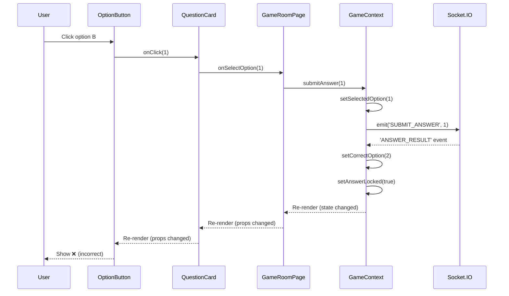

# React Concepts Explained: QuizStorm Edition

## 📚 Table of Contents
1. [What is React?](#what-is-react)
2. [Virtual DOM](#virtual-dom)
3. [Components & JSX](#components--jsx)
4. [Props](#props)
5. [State & Hooks](#state--hooks)
6. [React Router DOM](#react-router-dom)
7. [Context API](#context-api)
8. [Advanced Hooks we Used](#advanced-hooks-we-used)
9. [React 19 Features](#react-19-features)

---

## 🎯 What is React?

**React** is a **JavaScript library** for building user interfaces, created by Facebook (Meta).

### Key Concepts:
- **Component-Based**: UI is split into reusable pieces (components)
- **Declarative**: You describe *what* UI should look like, React handles *how* to update it
- **Efficient Updates**: Uses Virtual DOM to minimize actual DOM changes
- **One-Way Data Flow**: Data flows down from parent to child components

### In QuizStorm:
Every page, button, timer, and card is a React component. The entire app is built by composing these components together.

---

## 🌳 Virtual DOM

### What is the DOM?

**DOM (Document Object Model)** = The tree structure representing your HTML page in memory.

```html
<html>
  <body>
    <div id="root">
      <h1>Quiz</h1>
      <button>Start</button>
    </div>
  </body>
</html>
```

This becomes a tree of nodes that JavaScript can manipulate.

### The Problem with Real DOM

Updating the real DOM is **slow** because:
1. Browser has to recalculate styles
2. Layout must be recomputed
3. Page must be repainted

Every change = performance cost.

### Virtual DOM Solution

**Virtual DOM** = A lightweight JavaScript copy of the real DOM.

**How it works:**

1. **Initial Render**: React creates a Virtual DOM tree
2. **State Changes**: When data changes, React creates a NEW Virtual DOM tree
3. **Diffing**: React compares old vs new Virtual DOM (called "reconciliation")
4. **Minimal Updates**: Only changed nodes are updated in real DOM

**Example:**

```jsx
// Old Virtual DOM
<div>
  <h1>Score: 0</h1>
  <button>Submit</button>
</div>

// New Virtual DOM (score changed)
<div>
  <h1>Score: 100</h1>  ← Only this changed!
  <button>Submit</button>
</div>

// React only updates the <h1> in real DOM, not the whole tree
```

### Why It's Fast:

- **JavaScript operations** (Virtual DOM diff) are much faster than DOM operations
- **Batching**: React can batch multiple updates together
- **Minimal changes**: Only what actually changed gets updated

### In QuizStorm:

When timer counts down from 30→29→28, React doesn't re-render the entire page. It only updates the number inside the timer component.

---

## 🧩 Components & JSX

### What is a Component?

A **component** is a reusable piece of UI. Think of it like a LEGO brick.

**Two types:**
1. **Function Components** (modern, what we use)
2. **Class Components** (old style, we don't use these)

### Function Component Example

```jsx
function WelcomeMessage() {
  return <h1>Welcome to QuizStorm!</h1>;
}
```

### What is JSX?

**JSX = JavaScript XML**

It looks like HTML but it's actually JavaScript:

```jsx
const element = <h1>Hello!</h1>;
```

Gets compiled to:

```javascript
const element = React.createElement('h1', null, 'Hello!');
```

### JSX Rules:

1. **Single root element** (or use `<></>` Fragment)
   ```jsx
   // ✅ Good
   return (
     <div>
       <h1>Title</h1>
       <p>Text</p>
     </div>
   );
   
   // ❌ Bad
   return (
     <h1>Title</h1>
     <p>Text</p>
   );
   ```

2. **Close all tags** (even self-closing like ``)
   ```jsx
     // ✅
       // ❌
   ```

3. **JavaScript expressions** in `{}`
   ```jsx
   const name = "QuizStorm";
   return <h1>Welcome to {name}!</h1>;
   ```

4. **className not class**
   ```jsx
   <div className="container"></div>  // ✅
   <div class="container"></div>      // ❌ (class is JS keyword)
   ```

### Real Example from QuizStorm

[`OptionButton.jsx`](file:///Users/sohamkarandikar/Documents/QuizStorm/frontend/src/components/game/OptionButton.jsx#L36-54):

```jsx
const OptionButton = ({ option, optionIndex, isSelected, isCorrect, showResult, onClick, disabled }) => {
    return (
        <button
            className={getButtonClass()}
            onClick={onClick}
            disabled={disabled}
            type="button"
        >
            {/* Option letter (A, B, C, D) */}
            <span className={`w-10 h-10 rounded-full ${getLetterColor()}`}>
                {String.fromCharCode(65 + optionIndex)}
            </span>
            
            {/* Option text */}
            <span className="flex-1 text-left font-doodle text-xl font-bold">
                {option}
            </span>

            {/* Show checkmark if correct */}
            {showResult && isCorrect && (
                <span className="text-4xl absolute right-4 animate-bounce">✅</span>
            )}
            
            {/* Show X if wrong */}
            {showResult && isSelected && !isCorrect && (
                <span className="text-4xl absolute right-4 animate-wiggle">❌</span>
            )}
        </button>
    );
};
```

**Breakdown:**
- `{option}` - JavaScript variable embedded in JSX
- `{String.fromCharCode(65 + optionIndex)}` - JavaScript expression (65='A', 66='B', etc.)
- `{showResult && isCorrect && (...)}` - Conditional rendering (only show if both true)
- `className={getButtonClass()}` - Dynamic class names

---

## 📦 Props

### What are Props?

**Props = Properties** passed from parent component to child component.

Think of them as **function arguments for components**.

### Characteristics:
- **Read-only** (child cannot modify them)
- **One-way flow** (parent → child)
- **Any data type** (strings, numbers, objects, functions, etc.)

### Example from QuizStorm

**Parent Component** ([`QuestionCard.jsx`](file:///Users/sohamkarandikar/Documents/QuizStorm/frontend/src/components/game/QuestionCard.jsx#L66-75)):

```jsx
const QuestionCard = ({ questionText, options, selectedOption, correctOption, onSelectOption, disabled }) => {
    return (
        <div className="question-card">
            <h2 className="question-text">{questionText}</h2>
            
            <div className="options-grid">
                {options.map((option, index) => (
                    <OptionButton
                        key={index}
                        option={option}              {/* ← Passing prop */}
                        optionIndex={index}          {/* ← Passing prop */}
                        isSelected={selectedOption === index}  {/* ← Passing prop */}
                        isCorrect={correctOption === index}    {/* ← Passing prop */}
                        showResult={correctOption !== null}    {/* ← Passing prop */}
                        onClick={() => onSelectOption(index)}  {/* ← Passing function */}
                        disabled={disabled}          {/* ← Passing prop */}
                    />
                ))}
            </div>
        </div>
    );
};
```

**Child Component** ([`OptionButton.jsx`](file:///Users/sohamkarandikar/Documents/QuizStorm/frontend/src/components/game/OptionButton.jsx#L4-12)):

```jsx
const OptionButton = ({
    option,         // ← Receiving prop
    optionIndex,    // ← Receiving prop
    isSelected,     // ← Receiving prop
    isCorrect,      // ← Receiving prop
    showResult,     // ← Receiving prop
    onClick,        // ← Receiving function prop
    disabled,       // ← Receiving prop
}) => {
    // Use props here
    return <button onClick={onClick}>{option}</button>;
};
```

### Prop Destructuring

Instead of:
```jsx
const OptionButton = (props) => {
    return <button>{props.option}</button>;
};
```

We use **destructuring**:
```jsx
const OptionButton = ({ option, isSelected, onClick }) => {
    return <button>{option}</button>;
};
```

Cleaner and easier to read!

### Props vs State

| Props | State |
|-------|-------|
| Passed FROM parent | Managed WITHIN component |
| Read-only | Can be updated |
| Component re-renders when props change | Component re-renders when state changes |
| Like function parameters | Like function variables |

---

## 🎣 State & Hooks

### What is State?

**State** = Data that changes over time and causes re-renders.

Examples:
- User input in a form
- Timer countdown
- Items in a shopping cart
- Current score in a game

### What are Hooks?

**Hooks** = Special functions that let you "hook into" React features.

**Rules of Hooks:**
1. Only call at the **top level** (not inside loops, conditions, or nested functions)
2. Only call in **React function components** or custom hooks
3. Names must start with **"use"** (convention)

---

## 📌 useState Hook

### Purpose: Add state to function components

### Syntax:
```jsx
const [value, setValue] = useState(initialValue);
```

- `value` = Current state value
- `setValue` = Function to update state
- `initialValue` = Starting value

### Example from QuizStorm

[`GameContext.jsx`](file:///Users/sohamkarandikar/Documents/QuizStorm/frontend/src/context/GameContext.jsx#L31-61):

```jsx
const GameProvider = ({ children }) => {
    // Game state
    const [roomCode, setRoomCode] = useState(null);
    const [players, setPlayers] = useState([]);
    const [gameStatus, setGameStatus] = useState('waiting');
    
    // Question state
    const [currentQuestion, setCurrentQuestion] = useState(null);
    const [timeRemaining, setTimeRemaining] = useState(0);
    
    // Answer state
    const [selectedOption, setSelectedOption] = useState(null);
    const [answerLocked, setAnswerLocked] = useState(false);
    const [correctOption, setCorrectOption] = useState(null);
    
    // Leaderboard state
    const [leaderboard, setLeaderboard] = useState([]);
    const [winner, setWinner] = useState(null);
    
    // Socket instance
    const [socket, setSocket] = useState(null);
    
    // Later, update state:
    setTimeRemaining(30);  // Timer starts at 30
    setSelectedOption(2);  // Player selected option C (index 2)
    setAnswerLocked(true); // Lock in answer
};
```

### How setState Works:

```jsx
// ❌ WRONG: Direct mutation
timeRemaining = 29;

// ✅ CORRECT: Use setter function
setTimeRemaining(29);
```

**Why?** React needs to know state changed to trigger re-render.

### Updating Based on Previous State:

```jsx
// ❌ BAD: May use stale value
setCount(count + 1);

// ✅ GOOD: Use updater function
setCount(prevCount => prevCount + 1);
```

### State Updates are Asynchronous:

```jsx
setCount(5);
console.log(count);  // Still old value! (useState is async)
```

---

## ⚡ useEffect Hook

### Purpose: Perform side effects (things outside React's control)

**Side effects include:**
- API calls
- Setting up timers
- Subscribing to events (WebSockets)
- Updating document title
- localStorage operations

### Syntax:
```jsx
useEffect(() => {
    // Code to run
    
    return () => {
        // Cleanup (optional)
    };
}, [dependencies]);
```

### Dependency Array:

| Dependency Array | Behavior |
|------------------|----------|
| `[]` (empty) | Run once on mount only |
| `[value]` | Run when `value` changes |
| No array | Run on every render (usually bad!) |

### Real Example from QuizStorm

[`GameContext.jsx`](file:///Users/sohamkarandikar/Documents/QuizStorm/frontend/src/context/GameContext.jsx#L156-160):

```jsx
// Auto-initialize socket when user logs in
useEffect(() => {
    if (token && !socket) {
        initializeSocket();
    }
}, [token, socket, initializeSocket]);
// ↑ Re-runs whenever token, socket, or initializeSocket changes
```

**What's happening:**
1. Component mounts → `useEffect` runs
2. If user has token and no socket → initialize socket
3. If `token` changes (user logs in/out) → run again
4. If `socket` changes → run again

### Socket Event Listeners Example

[`GameContext.jsx`](file:///Users/sohamkarandikar/Documents/QuizStorm/frontend/src/context/GameContext.jsx#L87-91):

```jsx
socketInstance.on('player-joined', (data) => {
    console.log('👤 Player joined:', data);
    setPlayers(data.players);
    setTotalPlayers(data.totalPlayers);
});
```

**Important:** Need cleanup to prevent memory leaks!

```jsx
useEffect(() => {
    if (socket) {
        const handlePlayerJoined = (data) => {
            setPlayers(data.players);
        };
        
        socket.on('player-joined', handlePlayerJoined);
        
        // Cleanup function
        return () => {
            socket.off('player-joined', handlePlayerJoined);
        };
    }
}, [socket]);
```

**Why cleanup?**
- Prevents duplicate listeners if component re-renders
- Removes listeners when component unmounts
- Avoids memory leaks

---

## 🎛️ useCallback Hook

### Purpose: Memoize (cache) functions to prevent unnecessary re-creations

### Problem without useCallback:

```jsx
const MyComponent = () => {
    const handleClick = () => {
        console.log('Clicked!');
    };
    // ↑ NEW function created on EVERY render!
    
    return <Button onClick={handleClick} />;
};
```

Every render = new function = child component thinks prop changed = unnecessary re-render.

### Solution with useCallback:

```jsx
const handleClick = useCallback(() => {
    console.log('Clicked!');
}, []);  // Dependencies
// ↑ Function only recreated if dependencies change
```

### Example from QuizStorm

[`GameContext.jsx`](file:///Users/sohamkarandikar/Documents/QuizStorm/frontend/src/context/GameContext.jsx#L165-170):

```jsx
const joinRoom = useCallback((code) => {
    if (!socket || !user) return;
    
    setRoomCode(code);
    emitJoinRoom(socket, code, user.id, user.username);
}, [socket, user]);  // Only recreate if socket or user changes
```

**Why it matters:**
- `joinRoom` is passed to child components as prop
- Without `useCallback`, new function on every render
- Child components would re-render unnecessarily
- With `useCallback`, same function reference unless dependencies change

---

## 🧠 useMemo Hook

### Purpose: Memoize (cache) computed values

### Problem:
```jsx
const expensiveCalculation = (num) => {
    console.log('Calculating...');
    return num * 2;  // Imagine this takes 1 second
};

const MyComponent = ({ number }) => {
    const result = expensiveCalculation(number);
    // ↑ Runs on EVERY render, even if number didn't change!
    
    return <div>{result}</div>;
};
```

### Solution with useMemo:

```jsx
const result = useMemo(() => expensiveCalculation(number), [number]);
// ↑ Only recalculates if number changes
```

### Example from QuizStorm

[`GameContext.jsx`](file:///Users/sohamkarandikar/Documents/QuizStorm/frontend/src/context/GameContext.jsx#L210-212):

```jsx
const isHost = useMemo(() => {
    return user && hostId && user.id === hostId;
}, [user, hostId]);
```

**Why?**
- `isHost` is computed from `user` and `hostId`
- Without `useMemo`: recalculated on every render
- With `useMemo`: only recalculated when `user` or `hostId` changes

### Another Example:

[`GameContext.jsx`](file:///Users/sohamkarandikar/Documents/QuizStorm/frontend/src/context/GameContext.jsx#L250-313):

```jsx
const value = useMemo(
    () => ({
        roomCode,
        players,
        isHost,
        gameStatus,
        // ... all context values
        joinRoom,
        startGame,
        submitAnswer,
        // ... all functions
    }),
    [
        roomCode,
        players,
        isHost,
        // ... all dependencies
    ]
);
```

**Purpose:** Memoize the entire context value object.
- Without `useMemo`: new object on every render → all consumers re-render
- With `useMemo`: same object unless dependencies change → less re-renders

---

## 🌐 React Router DOM

### What is React Router?

**React Router** = Library for handling navigation in single-page applications (SPAs).

**Traditional websites:**
- Click link → Browser requests new HTML page from server
- Full page reload

**Single Page Application (SPA):**
- Click link → JavaScript changes URL and swaps components
- No page reload, feels instant!

### Core Concepts:

1. **BrowserRouter** - Wraps entire app, enables routing
2. **Routes** - Container for all route definitions
3. **Route** - Maps a URL path to a component
4. **Link** - Navigation component (like `<a>` but for SPAs)
5. **useNavigate** - Hook for programmatic navigation
6. **useParams** - Hook to get URL parameters

### Our Router Setup

[`AppRouter.jsx`](file:///Users/sohamkarandikar/Documents/QuizStorm/frontend/src/routes/AppRouter.jsx):

```jsx
import { BrowserRouter, Routes, Route, Navigate } from 'react-router-dom';

const AppRouter = () => {
    return (
        <BrowserRouter>
            <Routes>
                {/* Public routes */}
                <Route path="/" element={<LandingPage />} />
                <Route path="/login" element={<LoginPage />} />
                
                {/* Protected routes */}
                <Route element={<ProtectedRoute />}>
                    <Route path="/lobby" element={<LobbyPage />} />
                    <Route path="/create-game" element={<CreateGamePage />} />
                    <Route path="/game/:roomCode" element={<GameRoomPage />} />
                    <Route path="/results/:roomCode" element={<ResultsPage />} />
                    <Route path="/profile/:username" element={<ProfilePage />} />
                    <Route path="/profile" element={<ProfilePage />} />
                    <Route path="/admin" element={<AdminDashboard />} />
                </Route>
                
                {/* Catch-all: redirect unknown URLs */}
                <Route path="*" element={<Navigate to="/login" replace />} />
            </Routes>
        </BrowserRouter>
    );
};
```

**Breakdown:**

| Component | Purpose |
|-----------|---------|
| `<BrowserRouter>` | Enables routing using HTML5 history API |
| `<Routes>` | Container that matches first matching route |
| `<Route path="/" element={...}>` | If URL is "/", show LandingPage |
| `<Route path="/game/:roomCode">` | Dynamic parameter (`:roomCode`) |
| `<Navigate to="/login" replace />` | Redirect component |

### URL Parameters (Dynamic Routes)

```jsx
<Route path="/game/:roomCode" element={<GameRoomPage />} />
```

- `:roomCode` = placeholder for any value
- `/game/ABC123` → `roomCode` = "ABC123"
- `/game/XYZ789` → `roomCode` = "XYZ789"

**Accessing params in component:**

```jsx
import { useParams } from 'react-router-dom';

const GameRoomPage = () => {
    const { roomCode } = useParams();
    // If URL is /game/ABC123, roomCode = "ABC123"
    
    return <h1>Room: {roomCode}</h1>;
};
```

### Navigation

#### 1. Link Component (Declarative)

```jsx
import { Link } from 'react-router-dom';

<Link to="/login" className="button">
    Go to Login
</Link>
```

Renders as `<a>` tag but prevents full page reload.

#### 2. useNavigate Hook (Programmatic)

```jsx
import { useNavigate } from 'react-router-dom';

const MyComponent = () => {
    const navigate = useNavigate();
    
    const handleSuccess = () => {
        navigate('/lobby');  // Go to /lobby
    };
    
    const goBack = () => {
        navigate(-1);  // Go back one page
    };
    
    return <button onClick={handleSuccess}>Continue</button>;
};
```

**When to use:**
- `<Link>` - User clicks to navigate
- `useNavigate()` - Navigate after action (login, form submit, etc.)

### Protected Routes

[`ProtectedRoute.jsx`](file:///Users/sohamkarandikar/Documents/QuizStorm/frontend/src/routes/ProtectedRoute.jsx):

```jsx
import { Navigate, Outlet } from 'react-router-dom';
import { useAuth } from '../context/AuthContext';

const ProtectedRoute = () => {
    const { user, loading } = useAuth();
    
    if (loading) {
        return <div>Loading...</div>;
    }
    
    if (!user) {
        return <Navigate to="/login" replace />;
    }
    
    return <Outlet />;  // Render child routes
};
```

**How it works:**

```jsx
<Route element={<ProtectedRoute />}>
    <Route path="/lobby" element={<LobbyPage />} />
    <Route path="/game/:roomCode" element={<GameRoomPage />} />
</Route>
```

1. User visits `/lobby`
2. `<ProtectedRoute>` checks if user is authenticated
3. If yes → `<Outlet />` renders `<LobbyPage />`
4. If no → `<Navigate to="/login">` redirects to login

**`<Outlet />`** = Placeholder for nested child routes

---

## 📡 Context API

### The Problem: Prop Drilling

**Scenario:** You need user data in a deeply nested component.

```jsx
<App user={user}>
  <Dashboard user={user}>
    <Sidebar user={user}>
      <Profile user={user}>
        <Avatar user={user} />  {/* Finally used here */}
      </Profile>
    </Sidebar>
  </Dashboard>
</App>
```

Every intermediate component must accept and pass down `user`, even if they don't use it!

### The Solution: Context API

**Context** = Global state accessible by any component without prop drilling.

### Creating Context

**Step 1: Create Context**

```jsx
import { createContext } from 'react';

const GameContext = createContext(null);
```

**Step 2: Create Provider Component**

[`GameContext.jsx`](file:///Users/sohamkarandikar/Documents/QuizStorm/frontend/src/context/GameContext.jsx#L27-316):

```jsx
export const GameProvider = ({ children }) => {
    // All game state
    const [roomCode, setRoomCode] = useState(null);
    const [players, setPlayers] = useState([]);
    const [gameStatus, setGameStatus] = useState('waiting');
    
    // All game functions
    const joinRoom = useCallback((code) => {
        // ...
    }, [socket, user]);
    
    const startGame = useCallback(() => {
        // ...
    }, [socket, roomCode]);
    
    // Package everything into context value
    const value = useMemo(() => ({
        roomCode,
        players,
        gameStatus,
        joinRoom,
        startGame,
        // ... everything else
    }), [roomCode, players, gameStatus, joinRoom, startGame]);
    
    return (
        <GameContext.Provider value={value}>
            {children}
        </GameContext.Provider>
    );
};
```

**Step 3: Create Custom Hook**

[`GameContext.jsx`](file:///Users/sohamkarandikar/Documents/QuizStorm/frontend/src/context/GameContext.jsx#L16-22):

```jsx
export const useGame = () => {
    const context = useContext(GameContext);
    if (!context) {
        throw new Error('useGame must be used within GameProvider');
    }
    return context;
};
```

**Step 4: Wrap App with Provider**

```jsx
<App>
  <GameProvider>
    <Routes>
      <Route path="/lobby" element={<LobbyPage />} />
      <Route path="/game/:roomCode" element={<GameRoomPage />} />
    </Routes>
  </GameProvider>
</App>
```

**Step 5: Use Context in Any Component**

```jsx
import { useGame } from '../context/GameContext';

const LobbyPage = () => {
    const { roomCode, players, startGame } = useGame();
    
    return (
        <div>
            <h1>Room: {roomCode}</h1>
            <p>Players: {players.length}</p>
            <button onClick={startGame}>Start Game</button>
        </div>
    );
};
```

**No prop drilling needed!** Any component can access game state directly.

### When to Use Context

✅ **Good for:**
- User authentication
- Theme (dark mode)
- Language/i18n
- Global app state

❌ **Not good for:**
- Frequently changing data (use state management library)
- Component-specific state
- Data that's only needed in one place

---

## 🎨 Advanced Hooks We Used

### 1. useContext

**Purpose:** Access Context values

```jsx
import { useContext } from 'react';
import { GameContext } from '../context/GameContext';

const MyComponent = () => {
    const gameData = useContext(GameContext);
    // Access all context values
};
```

We wrap this in a custom hook for better DX:

```jsx
const { roomCode, players } = useGame();
// Instead of: const { roomCode, players } = useContext(GameContext);
```

### 2. Custom Hooks

**Custom Hook** = Function that uses other hooks and follows naming convention (`useXyz`).

**Example: useAuth**

[`AuthContext.jsx`](file:///Users/sohamkarandikar/Documents/QuizStorm/frontend/src/context/AuthContext.jsx):

```jsx
export const useAuth = () => {
    const context = useContext(AuthContext);
    if (!context) {
        throw new Error('useAuth must be used within AuthProvider');
    }
    return context;
};

// Usage in any component:
const MyComponent = () => {
    const { user, login, logout } = useAuth();
    
    if (!user) return <p>Please log in</p>;
    
    return <p>Welcome, {user.username}!</p>;
};
```

**Benefits:**
- Cleaner syntax
- Error handling built-in
- Reusable logic

---

## 🆕 React 19 Features

We're using **React 19**, which includes:

### 1. Automatic Batching

**Old React:** Only batched updates in event handlers

```jsx
function handleClick() {
    setCount(c => c + 1);
    setFlag(f => !f);
    // ↑ Both updates batched into one re-render
}

setTimeout(() => {
    setCount(c => c + 1);
    setFlag(f => !f);
    // ↑ Two separate re-renders
}, 1000);
```

**React 19:** Batches ALL updates, even in timeouts, promises, etc.

```jsx
setTimeout(() => {
    setCount(c => c + 1);
    setFlag(f => !f);
    // ↑ Still batched! Only one re-render
}, 1000);
```

### 2. Concurrent Features

React can:
- Pause rendering
- Resume later
- Abandon rendering if new update comes in

Makes app more responsive under heavy load.

### 3. Improved useEffect

Better cleanup behavior and more predictable timing.

---

## 📊 React Lifecycle

### Function Component Lifecycle (with Hooks)

```jsx
const MyComponent = () => {
    // 1. Component Creation (every render)
    console.log('Component rendering...');
    
    // 2. Mount (first render only)
    useEffect(() => {
        console.log('Component mounted!');
        
        // 4. Unmount (cleanup)
        return () => {
            console.log('Component will unmount');
        };
    }, []);  // Empty array = run once
    
    // 3. Update (when 'count' changes)
    useEffect(() => {
        console.log('Count changed:', count);
    }, [count]);
    
    return <div>Hello</div>;
};
```

**Order of execution:**

1. **Render** → Function body runs
2. **Commit** → DOM is updated
3. **Effect** → `useEffect` runs
4. **Cleanup** → Previous effect cleanup runs (if any)

---

## 🔄 Data Flow in QuizStorm

### Example: Answering a Question



**Step by step:**

1. User clicks "Option B"
2. `OptionButton` calls its `onClick` prop
3. Bubbles up to `QuestionCard.onSelectOption`
4. Bubbles up to `GameRoomPage.handleOptionSelect`
5. Calls `GameContext.submitAnswer(1)`
6. Context updates state: `setSelectedOption(1)`
7. Context emits socket event to server
8. Server responds with correct answer
9. Context updates state: `setCorrectOption(2)`, `setAnswerLocked(true)`
10. All components subscribed to GameContext re-render
11. UI updates to show ❌ for wrong answer

---

## 🎯 Key Takeaways

### React Fundamentals:
- **Components** = Reusable UI pieces
- **JSX** = HTML-like syntax in JavaScript
- **Props** = Data passed from parent to child (read-only)
- **State** = Data that changes over time
- **Virtual DOM** = Fast diffing for minimal updates

### Hooks We Used:
- `useState` - Add state to components
- `useEffect` - Side effects (API calls, timers, subscriptions)
- `useCallback` - Memoize functions
- `useMemo` - Memoize computed values
- `useContext` - Access Context values

### React Router:
- `BrowserRouter` - Enable routing
- `Routes` & `Route` - Map URLs to components
- `Link` - Navigate declaratively
- `useNavigate` - Navigate programmatically
- `useParams` - Get URL parameters
- `Outlet` - Render nested routes
- `Navigate` - Redirect component

### Context API:
- Avoid prop drilling
- Create global state
- Use custom hooks for clean API

### Performance:
- Virtual DOM minimizes real DOM updates
- React batches state updates
- `useCallback`/`useMemo` prevent unnecessary work
- Context memoization prevents re-renders

---

## 🚀 Next Steps to Learn

1. **React Developer Tools** - Browser extension for debugging
2. **Error Boundaries** - Catch React errors gracefully
3. **Suspense** - Better loading states
4. **Portals** - Render outside parent DOM tree
5. **Refs** - Access DOM elements directly
6. **React Query** - Better data fetching
7. **State Management** - Redux, Zustand for complex apps

---

**Remember:** React is all about **thinking in components** and **managing state**. Master these concepts, and you'll build amazing UIs! 🎉
